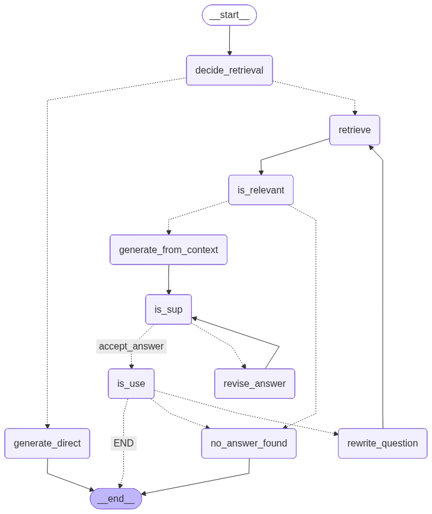

# Self-RAG: Self-Reflective Retrieval-Augmented Generation

A **Self-RAG (Self-Reflective Retrieval-Augmented Generation)** system that improves the reliability of Large Language Model responses by evaluating retrieved documents, detecting hallucinations, and refining answers through iterative reasoning.

Unlike traditional Retrieval-Augmented Generation (RAG) pipelines that retrieve documents only once, **Self-RAG introduces self-reflection loops** that allow the model to verify and improve its answers.

This project demonstrates how to implement a **Self-RAG pipeline using LangChain, LangGraph, and vector search**.

---

# Project Overview

Large Language Models often produce **hallucinated or unsupported answers** when relying only on internal knowledge.

Retrieval-Augmented Generation helps by retrieving relevant documents, but standard RAG systems still face challenges:

- Retrieved documents may not always be relevant
- Generated answers may not be grounded in retrieved evidence
- The response may not fully address the user’s question

Self-RAG addresses these issues by introducing **evaluation and correction stages** that allow the model to:

- Decide whether retrieval is required
- Evaluate document relevance
- Detect hallucinations
- Revise generated answers
- Rewrite queries when necessary

This results in **more accurate and reliable responses**.

---
## Project Architecture

---
# Self-RAG Workflow

The system follows a structured reasoning pipeline where the model decides whether to retrieve information, evaluates the relevance of retrieved documents, generates responses based on context, and performs self-evaluation to ensure factual correctness.

### Pipeline Steps

1. **Decide Retrieval**
   - Determines whether external documents are required to answer the query.

2. **Retrieve Documents**
   - Relevant documents are retrieved from the vector database.

3. **Relevance Evaluation**
   - The system evaluates whether the retrieved documents are relevant to the user query.

4. **Generate Answer from Context**
   - The LLM generates a response using the retrieved documents.

5. **Support / Hallucination Check**
   - The model verifies whether the generated answer is supported by the retrieved context.

6. **Answer Revision**
   - If the response is not sufficiently supported, the model revises the answer.

7. **Usefulness Check**
   - The system evaluates whether the response adequately answers the user’s question.

8. **Query Rewriting**
   - If relevant information is not found, the query is rewritten and the retrieval process repeats.

---

# Key Features

- Self-reflective Retrieval-Augmented Generation pipeline
- Intelligent retrieval decision making
- Document relevance grading
- Hallucination detection
- Iterative answer refinement
- Query rewriting for improved document retrieval
- Modular workflow using LangGraph

---

# Tech Stack

- **Python**
- **LangChain**
- **LangGraph**
- **FAISS (Vector Database)**
- **OpenAI API**
- **Pydantic**
